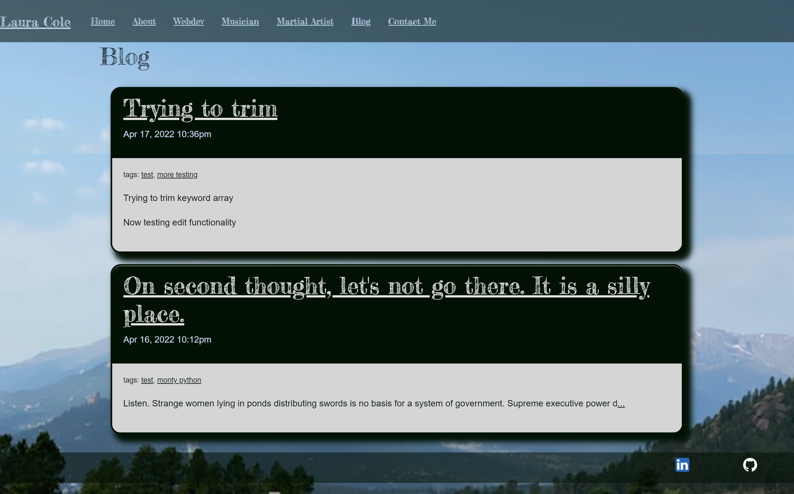

# My Blog

## Table of Contents

* [Description](#description)
* [Links](#links)
* [Screenshots](#screenshots)
* [Usage](#usage)
* [Technologies Used](#technologies-used)
* [Tests](#tests)
* [Credits](#credits)
* [Contributing](#contributing)
* [Questions](#questions)
* [Badges](#badges)

## Description

This application uses a MERNG stack with JWT authentication to build my professional blog.

## Links

[Deployed application on Heroku](https://lcolearts-blog.herokuapp.com/)

## Screenshots

Landing page:

Single entry details page:

Posts filtered by tag:

## Usage

This project is intended to be used as my professional blog.

## Technologies Used

        

## Tests

npm run test

## Credits

Favicon created by [Freepik](https://www.freepik.com) [Flaticon](https://www.flaticon.com/)

Many thanks to [Leif Hetland](https://github.com/leifehetland) for his help when I got stuck

## Contributing

N/A

## Questions

If you have further questions, you can reach me at lauracole1900@comcast.net. For more of my work, see [my GitHub](https://github.com/LauraCole1900).

## Badges

